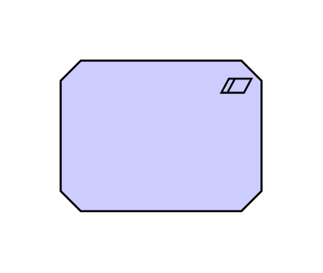

# Constraint

## Definition

```js
{
  _style: {
    entity: 'html=1;outlineConnect=0;whiteSpace=wrap;fillColor=#ccccff;shape=mxgraph.archimate.motiv;motivType=const',
  },
  _width: 100,
  _height: 75,
}
```

## Usage

```js
import { Constraint } from '@dinghy/standard-components-diagrams/archimate2'

<Constraint/>
```

## Preview


