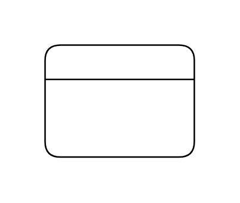

# Grouping

## Definition

```js
{
  _style: {
    entity: 'swimlane;html=1;fillColor=#ffffff;whiteSpace=wrap',
  },
  _width: 100,
  _height: 75,
}
```

## Usage

```js
import { Grouping } from '@dinghy/standard-components-diagrams/archimate2'

<Grouping/>
```

## Preview


