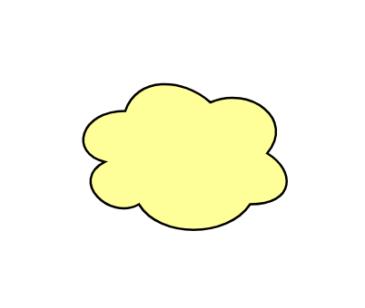

# Meaning

## Definition

```js
{
  _style: {
    entity: 'fillColor=#ffff99;whiteSpace=wrap;shape=cloud;html=1;',
  },
  _width: 100,
  _height: 75,
}
```

## Usage

```js
import { Meaning } from '@dinghy/standard-components-diagrams/archimate2'

<Meaning/>
```

## Preview


