# Archimate3 Application Entities

- [ApplicationCollaboration](./application-collaboration.md)  
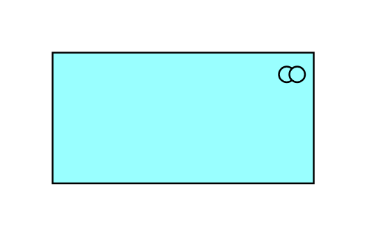

- [ApplicationComponent](./application-component.md)  

- [ApplicationEvent](./application-event.md)  
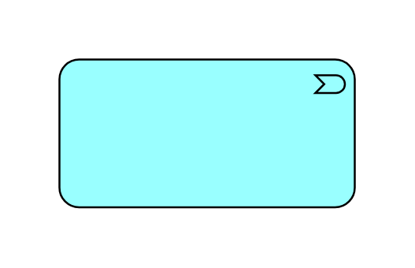

- [ApplicationFunction](./application-function.md)  
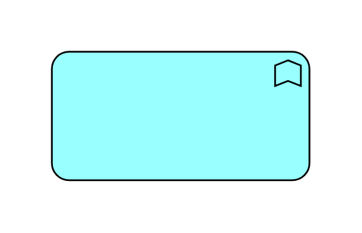

- [ApplicationInteraction](./application-interaction.md)  

- [ApplicationInterface](./application-interface.md)  

- [ApplicationProcess](./application-process.md)  
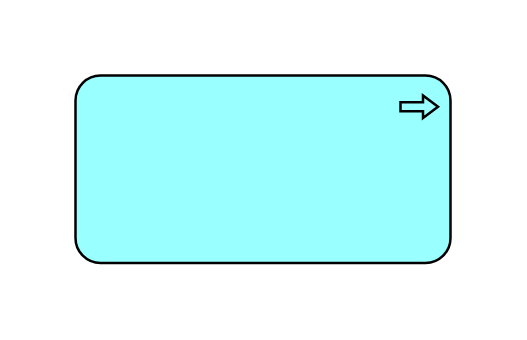

- [ApplicationService](./application-service.md)  

- [Collaboration](./collaboration.md)  
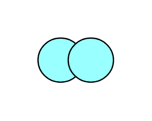

- [Component](./component.md)  
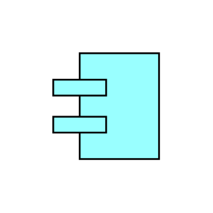

- [DataObject](./data-object.md)  
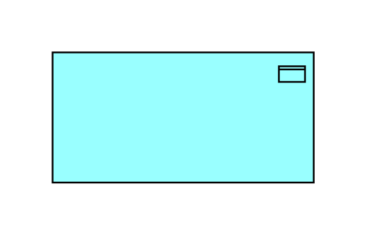

- [DataObject2](./data-object-2.md)  

- [Event](./event.md)  
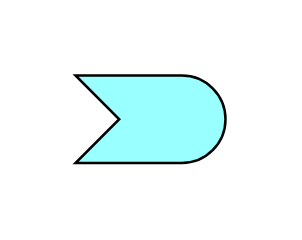

- [Function](./function.md)  

- [Interaction](./interaction.md)  
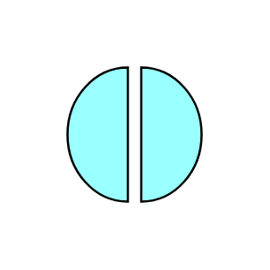

- [Interface](./interface.md)  
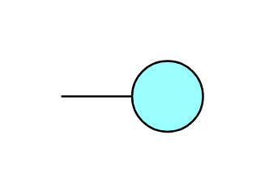

- [Process](./process.md)  

- [Service](./service.md)  
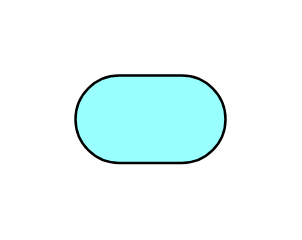
