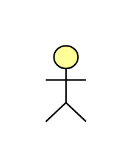

# Actor

## Definition

```js
{
  _style: {
    entity: 'html=1;outlineConnect=0;whiteSpace=wrap;fillColor=#ffff99;verticalLabelPosition=bottom;verticalAlign=top;align=center;shape=mxgraph.archimate3.actor;',
  },
  _width: 26.5,
  _height: 50,
}
```

## Usage

```js
import { Actor } from '@dinghy/standard-components-diagrams/archimate3Business'

<Actor/>
```

## Preview


