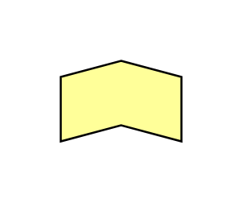

# Business Function 2

## Definition

```js
{
  _style: {
    entity: 'html=1;outlineConnect=0;whiteSpace=wrap;fillColor=#ffff99;shape=mxgraph.archimate3.function;',
  },
  _width: 60,
  _height: 40,
}
```

## Usage

```js
import { BusinessFunction2 } from '@dinghy/standard-components-diagrams/archimate3Business'

<BusinessFunction2/>
```

## Preview


