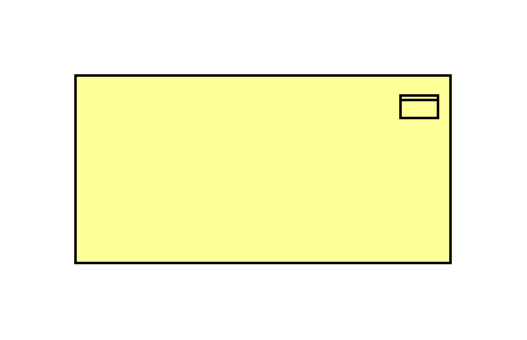

# Business Object

## Definition

```js
{
  _style: {
    entity: 'html=1;outlineConnect=0;whiteSpace=wrap;fillColor=#ffff99;shape=mxgraph.archimate3.application;appType=passive;archiType=square;',
  },
  _width: 150,
  _height: 75,
}
```

## Usage

```js
import { BusinessObject } from '@dinghy/standard-components-diagrams/archimate3Business'

<BusinessObject/>
```

## Preview


