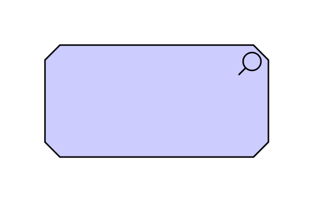
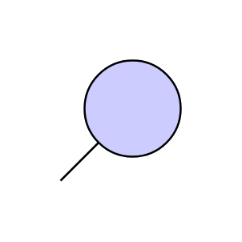
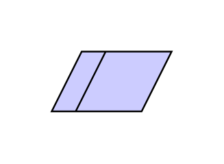
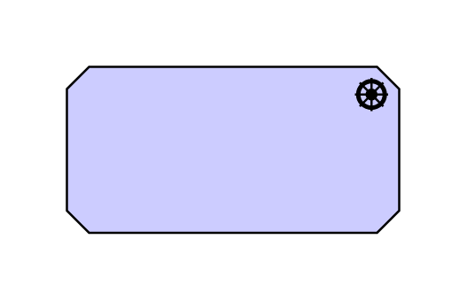
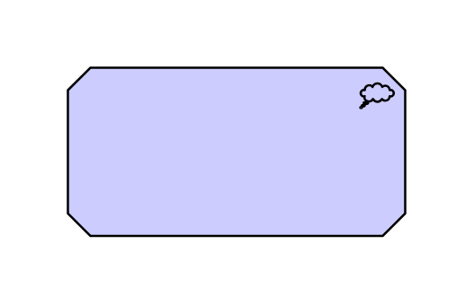
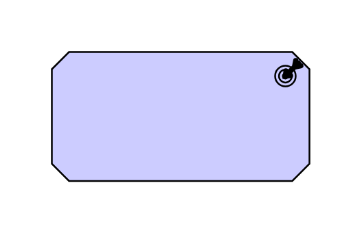
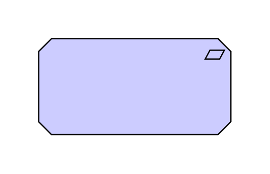
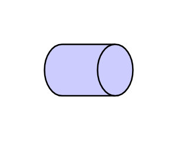
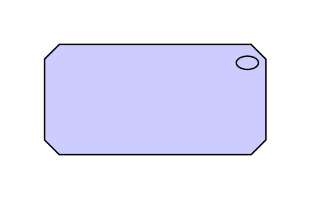
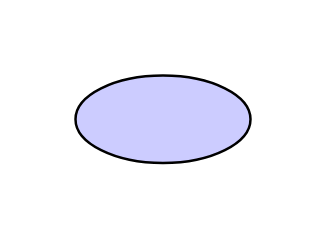

# Archimate3 Motivation Entities

- [Assessment](./assessment.md)  

- [Assessment2](./assessment-2.md)  

- [Constraint](./constraint.md)  

- [Constraint2](./constraint-2.md)  

- [Driver](./driver.md)  

- [Driver2](./driver-2.md)  

- [Goal](./goal.md)  

- [Goal2](./goal-2.md)  

- [Meaning](./meaning.md)  

- [Meaning2](./meaning-2.md)  

- [Outcome](./outcome.md)  

- [Outcome2](./outcome-2.md)  

- [Principle](./principle.md)  

- [Principle2](./principle-2.md)  

- [Requirement](./requirement.md)  

- [Requirement2](./requirement-2.md)  

- [Stakeholder](./stakeholder.md)  

- [Stakeholder2](./stakeholder-2.md)  

- [Value](./value.md)  

- [Value2](./value-2.md)  

