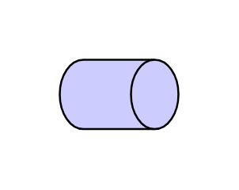

# Stakeholder 2

## Definition

```js
{
  _style: {
    entity: 'html=1;outlineConnect=0;whiteSpace=wrap;fillColor=#CCCCFF;shape=mxgraph.archimate3.role;',
  },
  _width: 60,
  _height: 35,
}
```

## Usage

```js
import { Stakeholder2 } from '@dinghy/standard-components-diagrams/archimate3Motivation'

<Stakeholder2/>
```

## Preview


