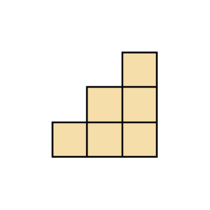

# Capability 2

## Definition

```js
{
  _style: {
    entity: 'html=1;outlineConnect=0;whiteSpace=wrap;fillColor=#F5DEAA;shape=mxgraph.archimate3.capability;',
  },
  _original_width: 40,
  _original_height: 40,

}
```

## Usage

```js
import { Capability2 } from '@dinghy/standard-components-diagrams/archimate3Strategy'

<Capability2/>
```

## Preview


