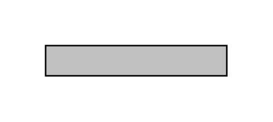

# Additional Participant, Non-Initiating

## Definition

```js
{
  _style: {
    entity: 'shape=mxgraph.bpmn.task2;part=1;taskMarker=abstract;rectStyle=square;fillColor=#C0C0C0;whiteSpace=wrap;html=1;',
  },
  _width: 120,
  _height: 20,
}
```

## Usage

```js
import { AdditionalParticipantNonInitiating } from '@dinghy/standard-components-diagrams/bpmn2Choreographies'

<AdditionalParticipantNonInitiating/>
```

## Preview


