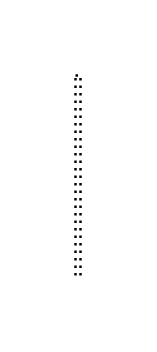

# Participant, Initiating, Bottom with Decorator

## Definition

```js
{
  _style: {
    entity: 'edgeStyle=orthogonalEdgeStyle;html=1;elbow=horizontal;endArrow=none;labelBackgroundColor=none;endSize=12;endFill=0;dashed=1;dashPattern=1 2;exitX=0.5;exitY=1;rounded=0;',
  },
  _width: 2,
  _height: 80,
}
```

## Usage

```js
import { ParticipantInitiatingBottomWithDecorator } from '@dinghy/standard-components-diagrams/bpmn2Choreographies'

<ParticipantInitiatingBottomWithDecorator/>
```

## Preview


