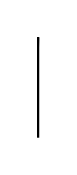

# Participant, Initiating, Top with Decorator 2

## Definition

```js
{
  _style: {
    entity: 'shape=message;html=1;',
  },
  _width: 1,
  _height: 80,
}
```

## Usage

```js
import { ParticipantInitiatingTopWithDecorator2 } from '@dinghy/standard-components-diagrams/bpmn2Choreographies'

<ParticipantInitiatingTopWithDecorator2/>
```

## Preview


