# BPMN 2.0 General Entities

- [Annotation](./annotation.md)  
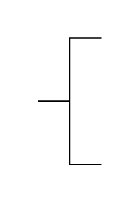

- [CallConversation](./call-conversation.md)  
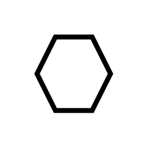

- [CallSubConversation](./call-sub-conversation.md)  
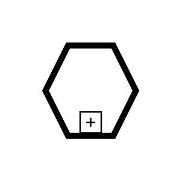

- [Conversation](./conversation.md)  

- [CrossFunctionalFlowchart](./cross-functional-flowchart.md)  
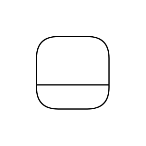

- [DataInput](./data-input.md)  
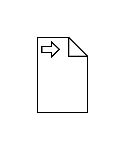

- [DataInputCollection](./data-input-collection.md)  
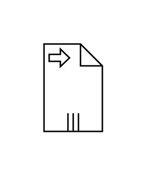

- [DataObject](./data-object.md)  
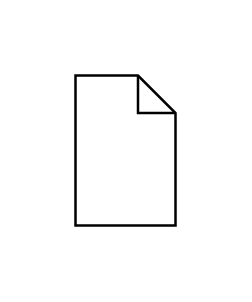

- [DataObject2](./data-object-2.md)  
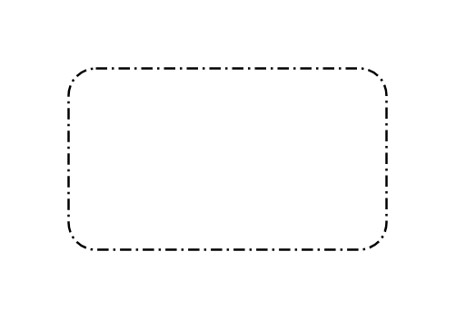

- [DataObjectCollection](./data-object-collection.md)  
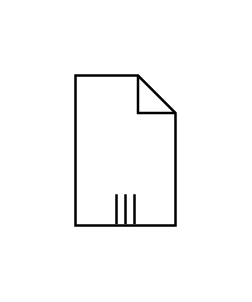

- [DataOutput](./data-output.md)  
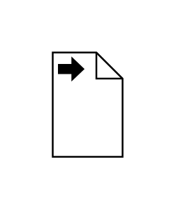

- [DataOutputCollection](./data-output-collection.md)  
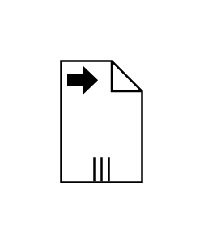

- [DataStore](./data-store.md)  
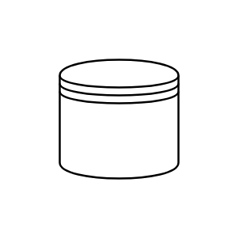

- [Group](./group.md)  
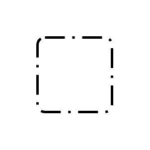

- [HorizontalLane](./horizontal-lane.md)  

- [HorizontalLane2](./horizontal-lane-2.md)  
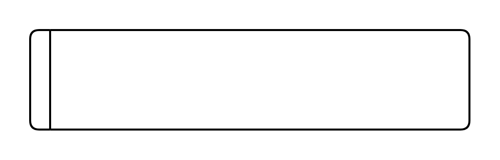

- [HorizontalLane3](./horizontal-lane-3.md)  
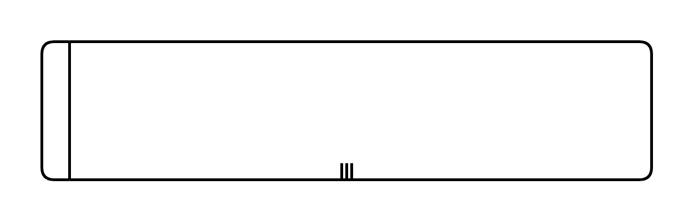

- [HorizontalPool1](./horizontal-pool-1.md)  
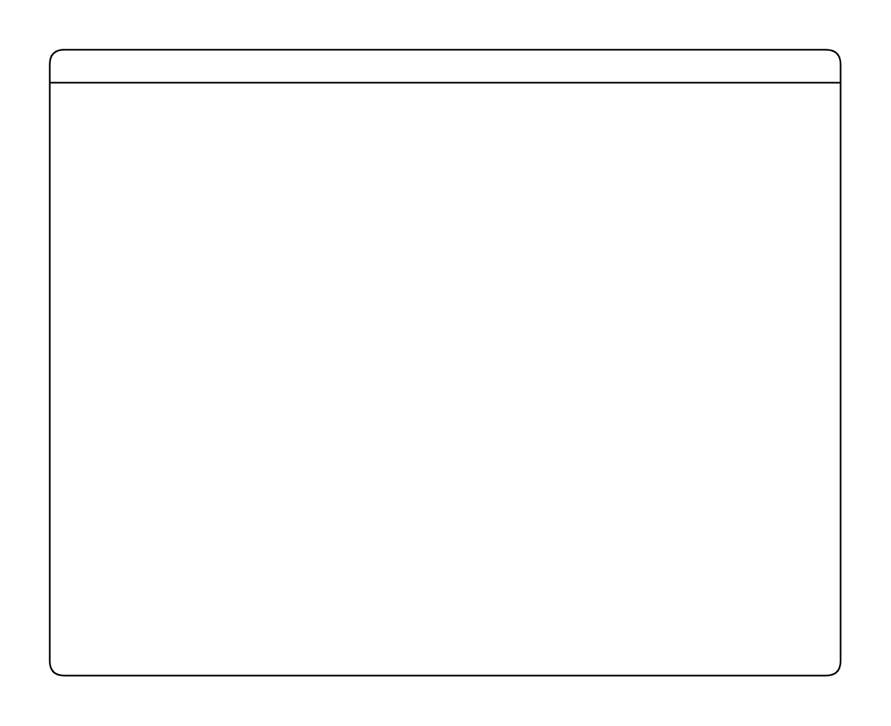

- [HorizontalPool2](./horizontal-pool-2.md)  

- [HorizontalSwimlane](./horizontal-swimlane.md)  
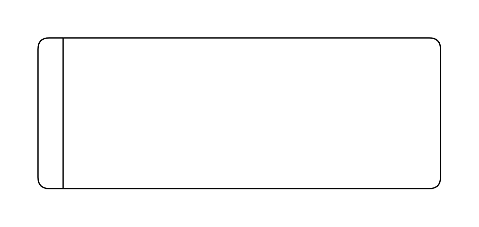

- [SubConversation](./sub-conversation.md)  
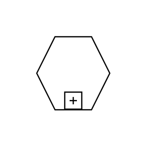

- [TextAnnotation](./text-annotation.md)  

- [VerticalLane](./vertical-lane.md)  
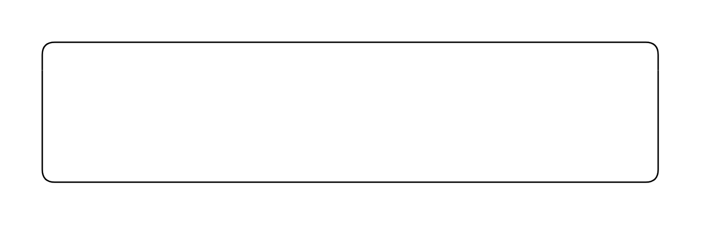

- [VerticalLane2](./vertical-lane-2.md)  
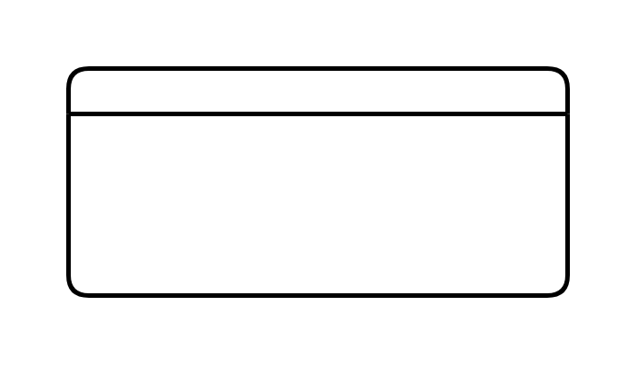

- [VerticalLane3](./vertical-lane-3.md)  
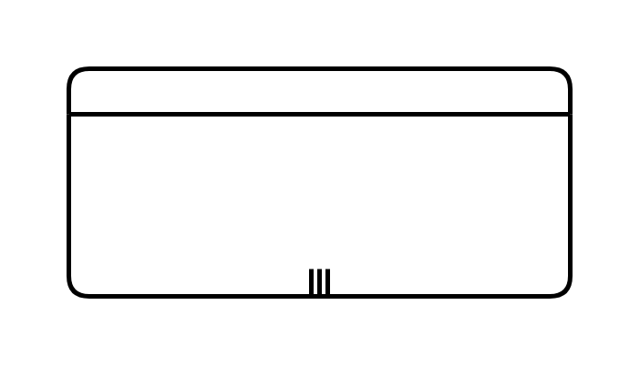

- [VerticalPool1](./vertical-pool-1.md)  

- [VerticalPool2](./vertical-pool-2.md)  
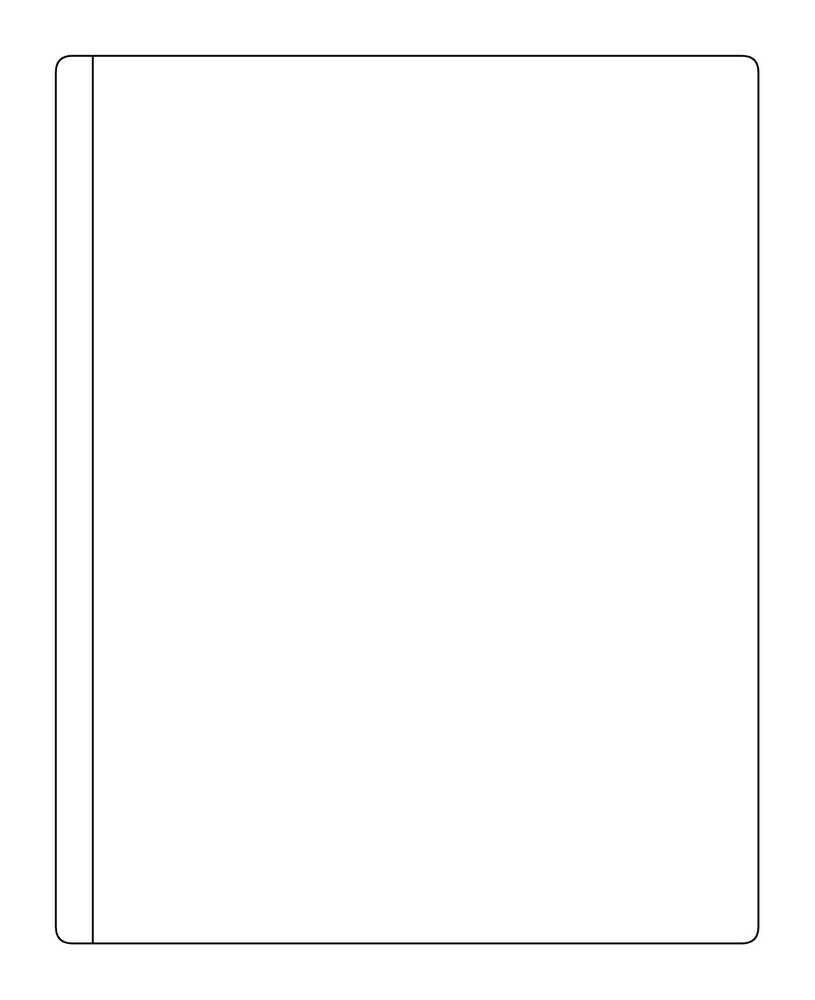

- [VerticalSwimlane](./vertical-swimlane.md)  
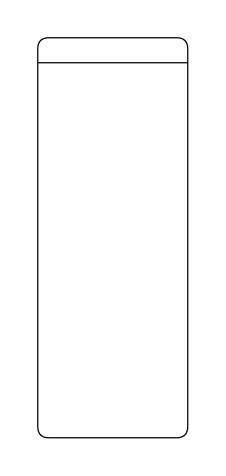
