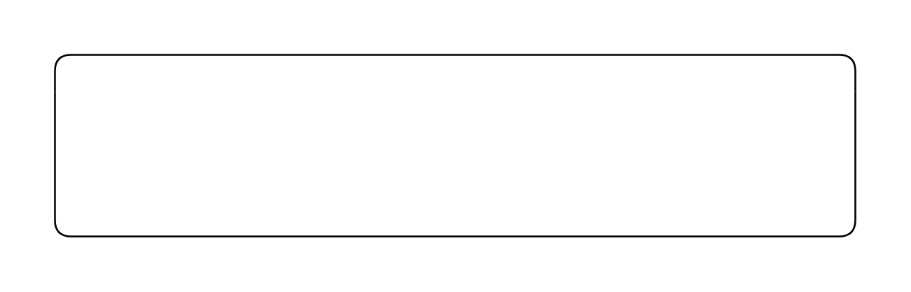

# Vertical Lane

## Definition

```js
{
  _style: {
    entity: 'swimlane;html=1;startSize=20;fontStyle=0;collapsible=0;horizontal=1;swimlaneLine=0;fillColor=none;whiteSpace=wrap;',
  },
  _width: 440,
  _height: 100,
}
```

## Usage

```js
import { VerticalLane } from '@dinghy/standard-components-diagrams/bpmn2General'

<VerticalLane/>
```

## Preview


