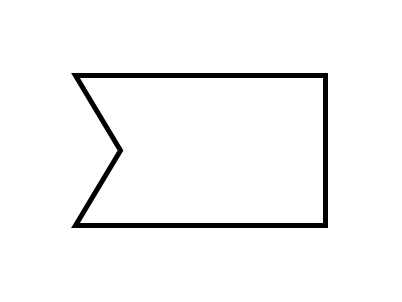

# Accept Event Action

## Definition

```js
{
  _style: {
    entity: 'html=1;shape=mxgraph.sysml.accEvent;strokeWidth=2;whiteSpace=wrap;align=center;',
  },
  _width: 100,
  _height: 60,
}
```

## Usage

```js
import { AcceptEventAction } from '@dinghy/standard-components-diagrams/sysmlActivities'

<AcceptEventAction/>
```

## Preview


