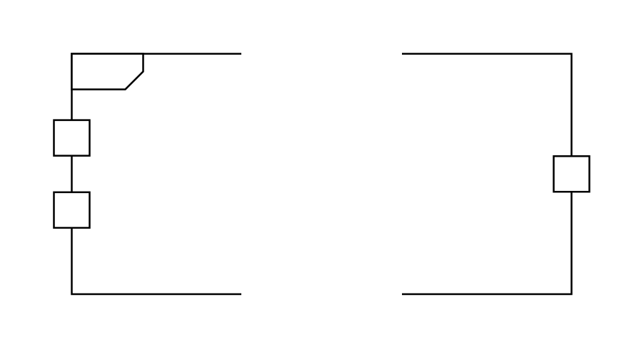

# Activity Parameter Node

## Definition

```js
{
  _style: {
    entity: 'html=1;shape=mxgraph.sysml.actParamNode;align=left;spacingLeft=15;verticalAlign=top;spacingTop=-3;',
  },
  _width: 300,
  _height: 135,
}
```

## Usage

```js
import { ActivityParameterNode } from '@dinghy/standard-components-diagrams/sysmlActivities'

<ActivityParameterNode/>
```

## Preview


