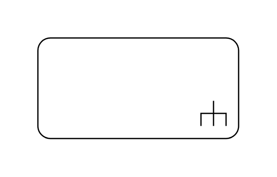

# Call Behavior Action

## Definition

```js
{
  _style: {
    entity: 'html=1;shape=mxgraph.sysml.callBehAct;whiteSpace=wrap;align=center;',
  },
  _width: 160,
  _height: 80,
}
```

## Usage

```js
import { CallBehaviorAction } from '@dinghy/standard-components-diagrams/sysmlActivities'

<CallBehaviorAction/>
```

## Preview


