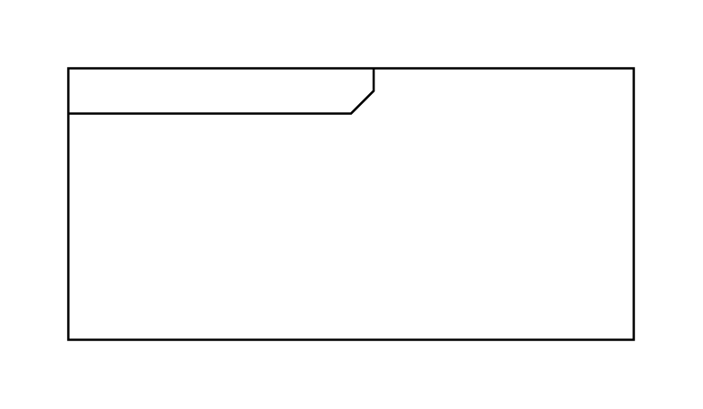

# Control Operator 2

## Definition

```js
{
  _style: {
    entity: 'html=1;shape=mxgraph.sysml.package;align=left;spacingLeft=5;verticalAlign=top;spacingTop=-3;labelX=135;html=1;overflow=fill;',
  },
  _width: 250,
  _height: 120,
}
```

## Usage

```js
import { ControlOperator2 } from '@dinghy/standard-components-diagrams/sysmlActivities'

<ControlOperator2/>
```

## Preview


