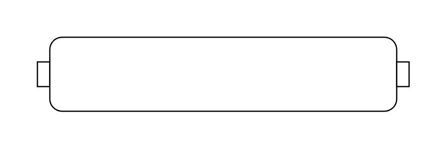

# Is Control

## Definition

```js
{
  _style: {
    entity: 'html=1;shape=mxgraph.sysml.isControl;whiteSpace=wrap;align=center;',
  },
  _width: 300,
  _height: 60,
}
```

## Usage

```js
import { IsControl } from '@dinghy/standard-components-diagrams/sysmlActivities'

<IsControl/>
```

## Preview


