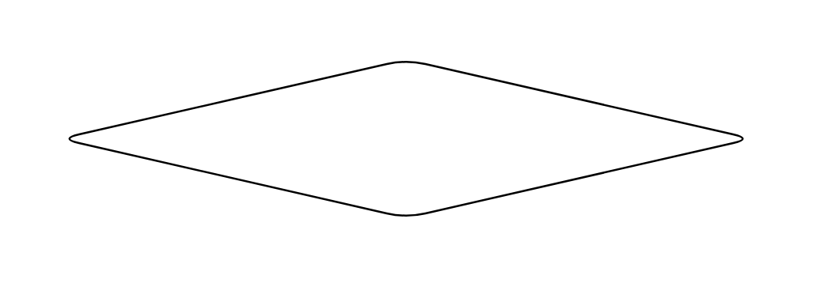

# Probability 3

## Definition

```js
{
  _style: {
    entity: 'shape=rhombus;html=1;whiteSpace=wrap;verticalLabelPosition=bottom;verticalAlignment=top;',
  },
  _width: 350,
  _height: 80,
}
```

## Usage

```js
import { Probability3 } from '@dinghy/standard-components-diagrams/sysmlActivities'

<Probability3/>
```

## Preview


