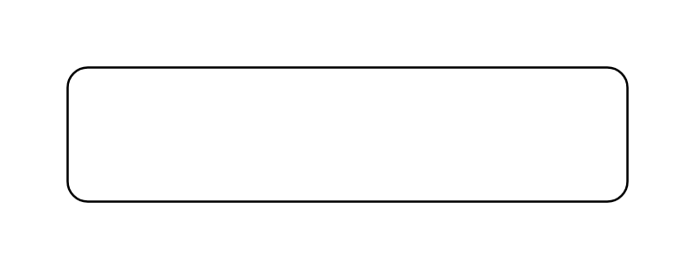

# Probability 7

## Definition

```js
{
  _style: {
    entity: 'shape=rect;whiteSpace=wrap;align=center;html=1;',
  },
  _width: 250,
  _height: 60,
}
```

## Usage

```js
import { Probability7 } from '@dinghy/standard-components-diagrams/sysmlActivities'

<Probability7/>
```

## Preview


