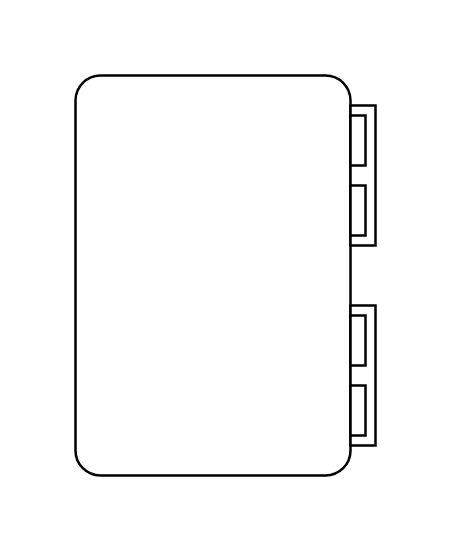

# Probability

## Definition

```js
{
  _style: {
    entity: 'html=1;shape=mxgraph.sysml.probability;whiteSpace=wrap;align=center;',
  },
  _width: 120,
  _height: 160,
}
```

## Usage

```js
import { Probability } from '@dinghy/standard-components-diagrams/sysmlActivities'

<Probability/>
```

## Preview


