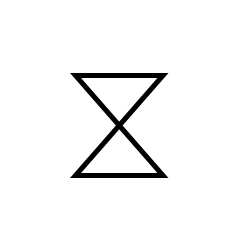

# Time Event

## Definition

```js
{
  _style: {
    entity: 'html=1;shape=mxgraph.sysml.timeEvent;strokeWidth=2;verticalLabelPosition=bottom;verticalAlignment=top;',
  },
  _width: 35,
  _height: 40,
}
```

## Usage

```js
import { TimeEvent } from '@dinghy/standard-components-diagrams/sysmlActivities'

<TimeEvent/>
```

## Preview


