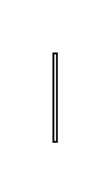

# Multibranch Shared Association 3

## Definition

```js
{
  _style: {
    entity: 'edgeStyle=elbowEdgeStyle;html=1;elbow=vertical;align=right;verticalAlign=bottom;endArrow=none;rounded=0;labelBackgroundColor=none;',
  },
  _width: 2,
  _height: 50,
}
```

## Usage

```js
import { MultibranchSharedAssociation3 } from '@dinghy/standard-components-diagrams/sysmlBlocks'

<MultibranchSharedAssociation3/>
```

## Preview


