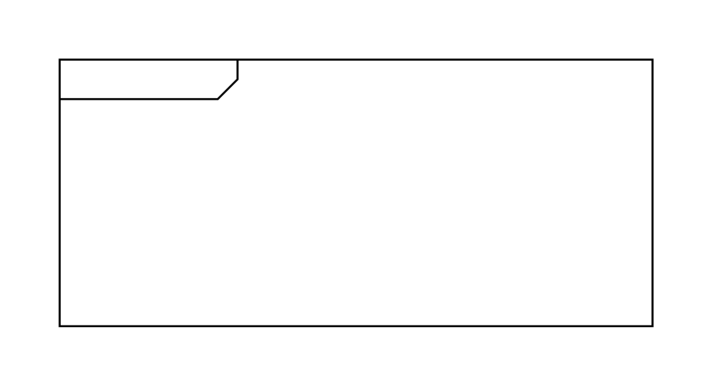

# Package

## Definition

```js
{
  _style: {
    entity: 'html=1;shape=mxgraph.sysml.package;html=1;overflow=fill;whiteSpace=wrap;',
  },
  _width: 300,
  _height: 135,
}
```

## Usage

```js
import { Package } from '@dinghy/standard-components-diagrams/sysmlBlocks'

<Package/>
```

## Preview


