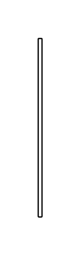

# Participant Property 2

## Definition

```js
{
  _style: {
    entity: 'edgeStyle=none;html=1;endArrow=none;verticalAlign=bottom;',
  },
  _width: 3,
  _height: 140,
}
```

## Usage

```js
import { ParticipantProperty2 } from '@dinghy/standard-components-diagrams/sysmlBlocks'

<ParticipantProperty2/>
```

## Preview


