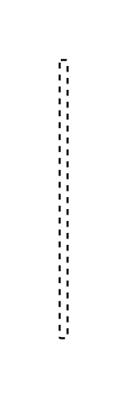

# Participant Property 3

## Definition

```js
{
  _style: {
    entity: 'edgeStyle=none;html=1;endArrow=none;dashed=1;',
  },
  _width: 4,
  _height: 140,
}
```

## Usage

```js
import { ParticipantProperty3 } from '@dinghy/standard-components-diagrams/sysmlBlocks'

<ParticipantProperty3/>
```

## Preview


