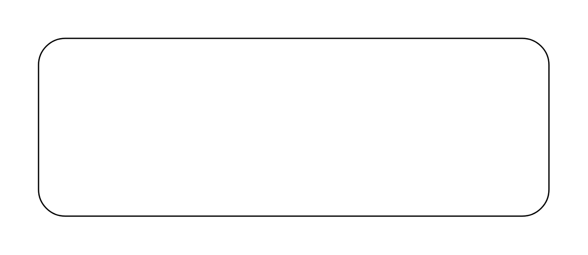

# Participant Property

## Definition

```js
{
  _style: {
    entity: 'shape=rect;html=1;fontStyle=1;whiteSpace=wrap;align=center;',
  },
  _width: 400,
  _height: 140,
}
```

## Usage

```js
import { ParticipantProperty } from '@dinghy/standard-components-diagrams/sysmlBlocks'

<ParticipantProperty/>
```

## Preview


