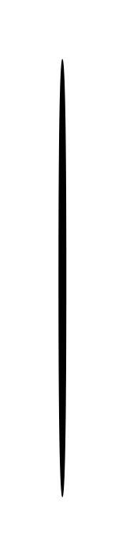

# Creation/Destruction Event 2

## Definition

```js
{
  _style: {
    entity: 'shape=ellipse;fillColor=strokeColor;html=1;',
  },
  _width: 3,
  _height: 220,
}
```

## Usage

```js
import { CreationDestructionEvent2 } from '@dinghy/standard-components-diagrams/sysmlInteractions'

<CreationDestructionEvent2/>
```

## Preview


