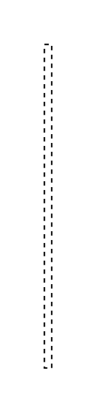

# Creation/Destruction Event 3

## Definition

```js
{
  _style: {
    entity: 'edgeStyle=none;dashed=1;endArrow=none;html=1;rounded=0;',
  },
  _width: 5,
  _height: 220,
}
```

## Usage

```js
import { CreationDestructionEvent3 } from '@dinghy/standard-components-diagrams/sysmlInteractions'

<CreationDestructionEvent3/>
```

## Preview


