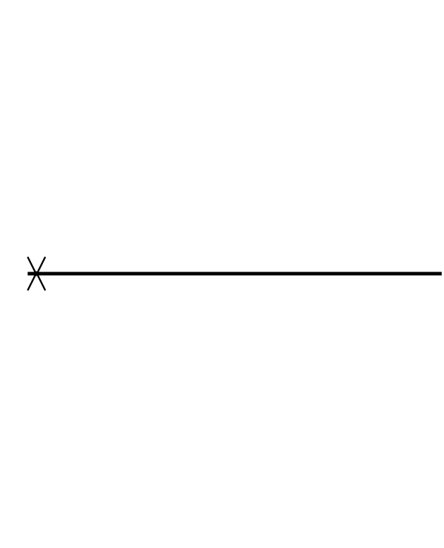

# Duration Constraint

## Definition

```js
{
  _style: {
    entity: 'html=1;shape=mxgraph.sysml.dimension;rotation=-90;verticalAlign=top;spacingTop=-5',
  },
  _width: 1,
  _height: 250,
}
```

## Usage

```js
import { DurationConstraint } from '@dinghy/standard-components-diagrams/sysmlInteractions'

<DurationConstraint/>
```

## Preview


