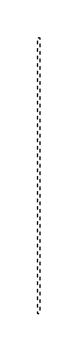

# Execution Specification 2

## Definition

```js
{
  _style: {
    entity: 'edgeStyle=none;html=1;dashed=1;endArrow=none;',
  },
  _width: 2,
  _height: 220,
}
```

## Usage

```js
import { ExecutionSpecification2 } from '@dinghy/standard-components-diagrams/sysmlInteractions'

<ExecutionSpecification2/>
```

## Preview


