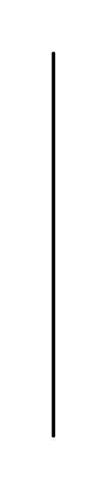

# Execution Specification

## Definition

```js
{
  _style: {
    entity: 'shape=rect;html=1;fillColor=#eeeeee;',
  },
  _width: 1,
  _height: 220,
}
```

## Usage

```js
import { ExecutionSpecification } from '@dinghy/standard-components-diagrams/sysmlInteractions'

<ExecutionSpecification/>
```

## Preview


