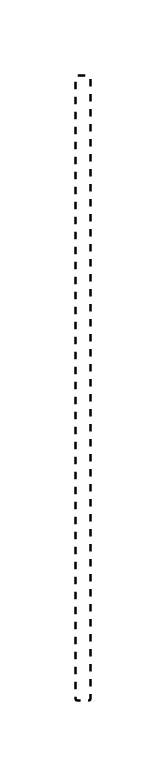

# Message 3

## Definition

```js
{
  _style: {
    entity: 'edgeStyle=none;html=1;endArrow=open;verticalAlign=bottom;endSize=12;endFill=1;dashed=1;',
  },
  _width: 6,
  _height: 250,
}
```

## Usage

```js
import { Message3 } from '@dinghy/standard-components-diagrams/sysmlInteractions'

<Message3/>
```

## Preview


