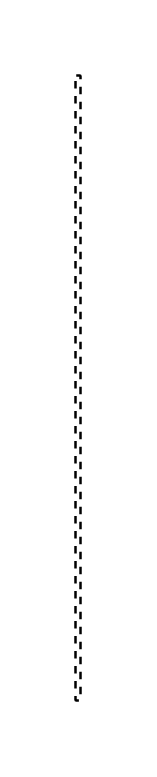

# Message

## Definition

```js
{
  _style: {
    entity: 'edgeStyle=none;dashed=1;html=1;endArrow=none;',
  },
  _width: 2,
  _height: 250,
}
```

## Usage

```js
import { Message } from '@dinghy/standard-components-diagrams/sysmlInteractions'

<Message/>
```

## Preview


