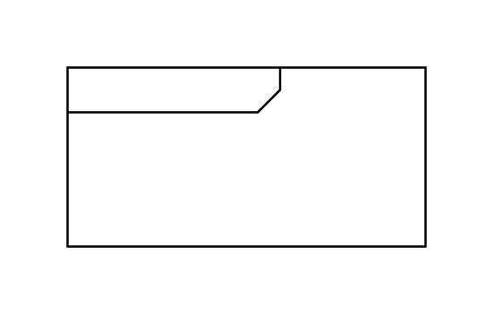

# Sequence Diagram

## Definition

```js
{
  _style: {
    entity: 'html=1;shape=mxgraph.sysml.package;overflow=fill;labelX=95;align=left;spacingLeft=5;verticalAlign=top;spacingTop=-3;',
  },
  _width: 160,
  _height: 80,
}
```

## Usage

```js
import { SequenceDiagram } from '@dinghy/standard-components-diagrams/sysmlInteractions'

<SequenceDiagram/>
```

## Preview


