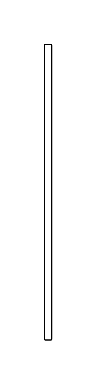

# Time Constraint 2

## Definition

```js
{
  _style: {
    entity: 'edgeStyle=none;html=1;endArrow=none;align=left;labelBackgroundColor=none;',
  },
  _width: 5,
  _height: 200,
}
```

## Usage

```js
import { TimeConstraint2 } from '@dinghy/standard-components-diagrams/sysmlInteractions'

<TimeConstraint2/>
```

## Preview


