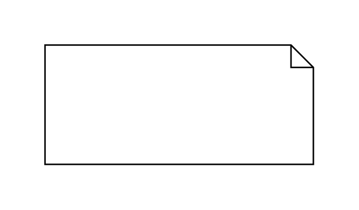

# Comment

## Definition

```js
{
  _style: {
    entity: 'shape=note;size=15;align=left;spacingLeft=10;html=1;whiteSpace=wrap;',
  },
  _width: 180,
  _height: 80,
}
```

## Usage

```js
import { Comment } from '@dinghy/standard-components-diagrams/sysmlModelElements'

<Comment/>
```

## Preview


