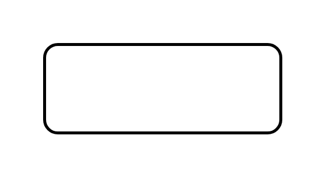

# Constraint Textual Note

## Definition

```js
{
  _style: {
    entity: 'shape=rect;strokeWidth=2;fontStyle=1;html=1;whiteSpace=wrap;align=center;',
  },
  _width: 160,
  _height: 60,
}
```

## Usage

```js
import { ConstraintTextualNote } from '@dinghy/standard-components-diagrams/sysmlModelElements'

<ConstraintTextualNote/>
```

## Preview


