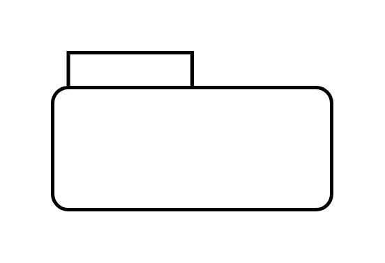

# Package (Name)

## Definition

```js
{
  _style: {
    entity: 'shape=folder;tabWidth=80;tabHeight=20;tabPosition=left;strokeWidth=2;html=1;whiteSpace=wrap;align=center;',
  },
  _width: 160,
  _height: 90,
}
```

## Usage

```js
import { PackageName } from '@dinghy/standard-components-diagrams/sysmlModelElements'

<PackageName/>
```

## Preview


