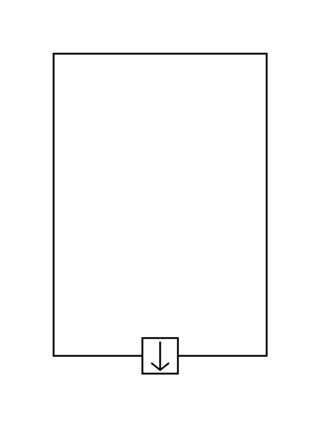
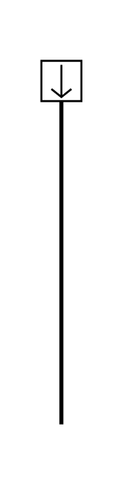
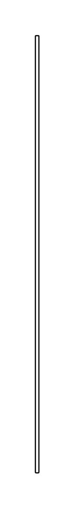
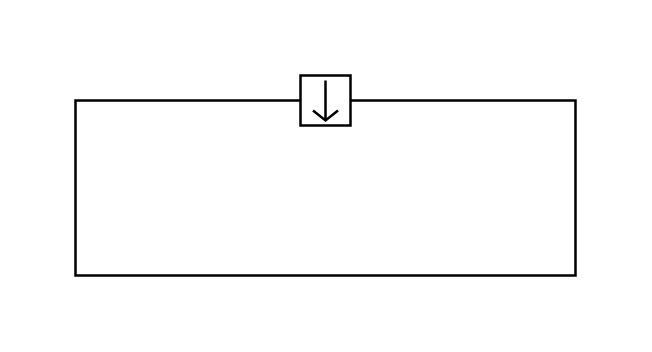
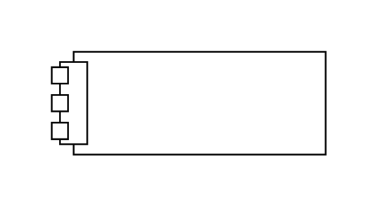
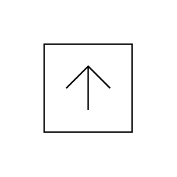

# Sysml Ports and Flows Entities

- [ItemFlow](./item-flow.md)  

- [ItemFlow10](./item-flow-10.md)  

- [ItemFlow2](./item-flow-2.md)  

- [ItemFlow3](./item-flow-3.md)  

- [ItemFlow4](./item-flow-4.md)  

- [ItemFlow5](./item-flow-5.md)  

- [ItemFlow6](./item-flow-6.md)  

- [ItemFlow7](./item-flow-7.md)  

- [ItemFlow8](./item-flow-8.md)  

- [ItemFlow9](./item-flow-9.md)  

- [ItemFlowEastOut](./item-flow-east-out.md)  

- [ItemFlowNorthIn](./item-flow-north-in.md)  

- [NestedPort](./nested-port.md)  

- [Port](./port.md)  

- [PortCompartmentNotation](./port-compartment-notation.md)  

- [PortConjugatedPorts](./port-conjugated-ports.md)  

- [PortDoubleFlowHorizontal](./port-double-flow-horizontal.md)  

- [PortFlowNorth](./port-flow-north.md)  

- [Ports](./ports.md)  

- [PortsWithFlowProperties](./ports-with-flow-properties.md)  

- [ProxyPort](./proxy-port.md)  

- [RequiredInterface](./required-interface.md)  

- [RequiredInterface2](./required-interface-2.md)  

- [RequiredInterface3](./required-interface-3.md)  

