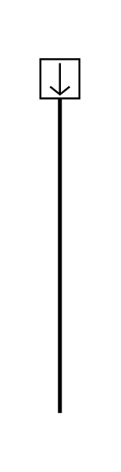

# Item Flow 2

## Definition

```js
{
  _style: {
    entity: 'html=1;shape=mxgraph.sysml.itemFlow;fontStyle=1;flowDir=N;flowType=in;whiteSpace=wrap;align=center;',
  },
  _width: 1,
  _height: 180,
}
```

## Usage

```js
import { ItemFlow2 } from '@dinghy/standard-components-diagrams/sysmlPortsAndFlows'

<ItemFlow2/>
```

## Preview


