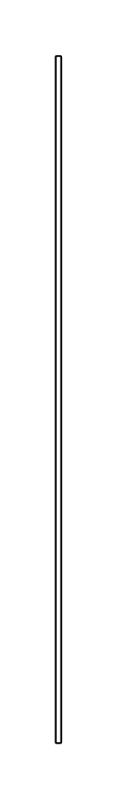

# Item Flow 7

## Definition

```js
{
  _style: {
    entity: 'shape=rect;html=1;overflow=fill;whiteSpace=wrap;recursiveResize=0;',
  },
  _width: 3,
  _height: 370,
}
```

## Usage

```js
import { ItemFlow7 } from '@dinghy/standard-components-diagrams/sysmlPortsAndFlows'

<ItemFlow7/>
```

## Preview


