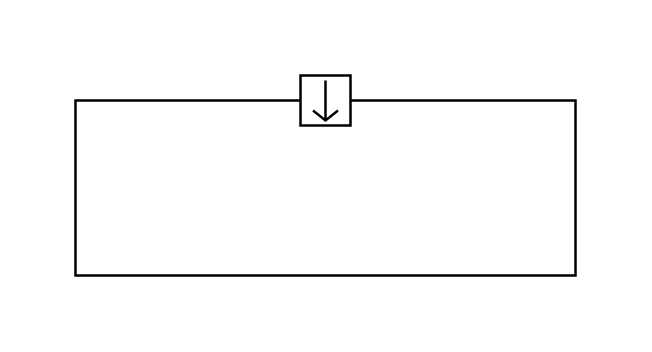

# Item Flow North In

## Definition

```js
{
  _style: {
    entity: 'html=1;shape=mxgraph.sysml.itemFlow;fontStyle=1;flowDir=n;flowType=in;whiteSpace=wrap;align=center;',
  },
  _width: 200,
  _height: 80,
}
```

## Usage

```js
import { ItemFlowNorthIn } from '@dinghy/standard-components-diagrams/sysmlPortsAndFlows'

<ItemFlowNorthIn/>
```

## Preview


