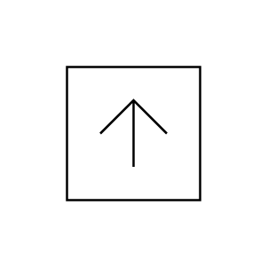

# Port, Flow North

## Definition

```js
{
  _style: {
    entity: 'html=1;shape=mxgraph.sysml.port;sysMLPortType=flowN;',
  },
  _original_width: 20,
  _original_height: 20,

}
```

## Usage

```js
import { PortFlowNorth } from '@dinghy/standard-components-diagrams/sysmlPortsAndFlows'

<PortFlowNorth/>
```

## Preview


