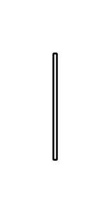

# Required Interface 3

## Definition

```js
{
  _style: {
    entity: 'edgeStyle=none;html=1;align=left;verticalAlign=top;endArrow=sysMLProvInt;endSize=12;exitX=0;exitY=0.5;',
  },
  _width: 2,
  _height: 60,
}
```

## Usage

```js
import { RequiredInterface3 } from '@dinghy/standard-components-diagrams/sysmlPortsAndFlows'

<RequiredInterface3/>
```

## Preview


