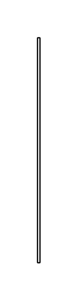

# Extension

## Definition

```js
{
  _style: {
    entity: 'endArrow=block;html=1;endFill=1;edgeStyle=none;endSize=12;labelBackgroundColor=none;align=left;',
  },
  _width: 2,
  _height: 180,
}
```

## Usage

```js
import { Extension } from '@dinghy/standard-components-diagrams/sysmlProfiles'

<Extension/>
```

## Preview


