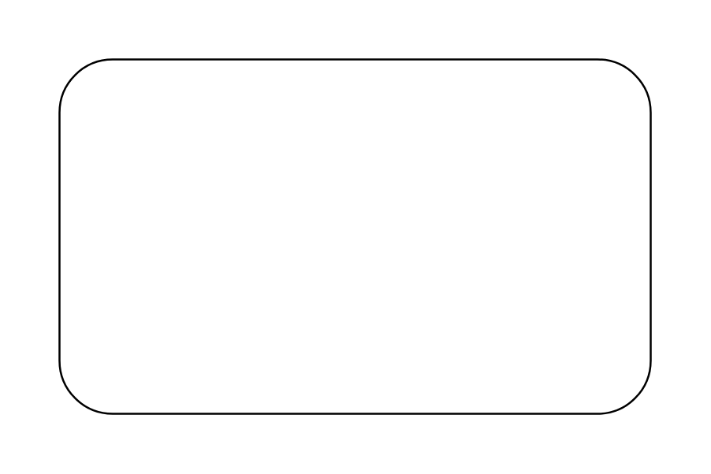
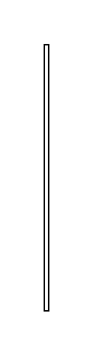

# Sysml Requirements Entities

- [CopyDependency](./copy-dependency.md)  

- [DeriveCallout](./derive-callout.md)  

- [DeriveDependency](./derive-dependency.md)  

- [MasterCallout](./master-callout.md)  

- [MasterCallout2](./master-callout-2.md)  

- [Requirement](./requirement.md)  

- [RequirementContainmentRelationship](./requirement-containment-relationship.md)  

- [RequirementContainmentRelationship2](./requirement-containment-relationship-2.md)  

- [RequirementDiagram](./requirement-diagram.md)  

- [SatisfyCallout](./satisfy-callout.md)  

