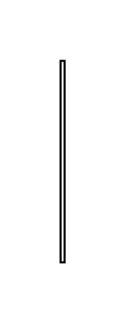

# Choice Pseudo State 3

## Definition

```js
{
  _style: {
    entity: 'edgeStyle=elbowEdgeStyle;html=1;elbow=vertical;align=right;endArrow=open;rounded=0;labelBackgroundColor=none;endSize=12;',
  },
  _width: 2,
  _height: 100,
}
```

## Usage

```js
import { ChoicePseudoState3 } from '@dinghy/standard-components-diagrams/sysmlStateMachines'

<ChoicePseudoState3/>
```

## Preview


